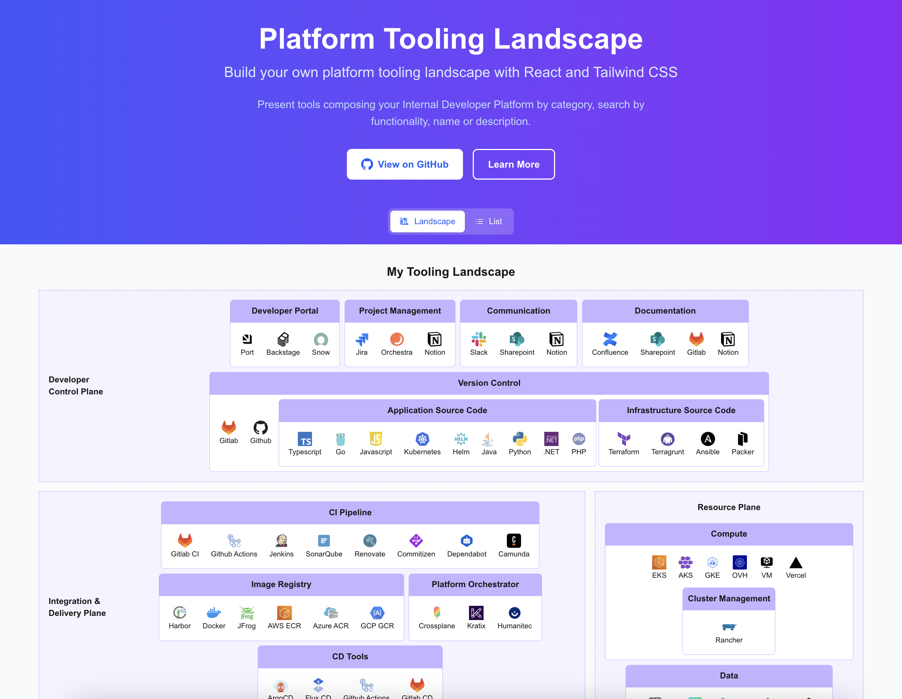
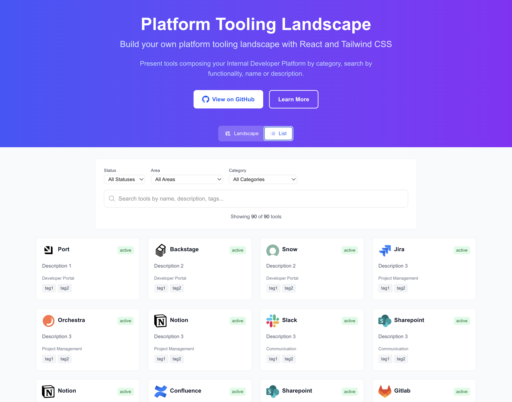

# React Tooling Landscape

An interactive React-based tooling landscape that transforms static platform engineering diagrams into dynamic, clickable interfaces. Perfect for platform teams who want to provide developers with an engaging way to explore their tooling ecosystem.





## ✨ Features

- **Dual View Modes**: Switch between visual landscape and detailed list views
- **Interactive Tool Display**: Click on any tool to learn more about it
- **Advanced Search & Filtering**: Real-time search with filters by status, area, and category
- **JSON-Driven Configuration**: Easy to customize and maintain
- **Responsive Design**: Works seamlessly on desktop and mobile
- **Modern Tech Stack**: Built with Next.js 15.5, React 19.1, and Tailwind CSS 4
- **TypeScript Support**: Fully typed for better development experience
- **Flexible Architecture**: Separates reusable landscape components from demo code

## 🚀 Quick Start

### Prerequisites

- Node.js 18+
- npm or yarn

### Installation

1. Clone the repository:

```bash
git clone https://github.com/your-username/react-tooling-landscape.git
cd react-tooling-landscape
```

2. Navigate to the demo application:

```bash
cd demo
```

3. Install dependencies:

```bash
npm install
```

4. Start the development server:

```bash
npm run dev
```

5. Open [http://localhost:3000](http://localhost:3000) in your browser

## 🎯 How It Works

1. **Configure your landscape**: Edit `demo/data/landscape.json` with your tools and categories
2. **Add tool logos**: Place SVG/PNG logos in `demo/public/logos/`
3. **Choose your view**: Toggle between landscape view for visual overview or list view for detailed exploration
4. **Search and filter**: Use the powerful search and filtering capabilities to find specific tools
5. **Customize styling**: Modify Tailwind classes in the components
6. **Deploy**: Build and deploy the demo application

## 📁 Project Structure

```
├── demo/                   # Demo Next.js application
│   ├── app/               # Next.js App Router
│   ├── components/
│   │   ├── landscape/     # Reusable landscape components
│   │   │   ├── Landscape.tsx      # Main landscape view
│   │   │   ├── ToolListView.tsx   # List view with search/filters
│   │   │   ├── ToolCard.tsx       # Individual tool card
│   │   │   ├── ToolSearchBar.tsx  # Search and filter controls
│   │   │   ├── Areas.tsx          # Area containers
│   │   │   ├── Category.tsx       # Category components
│   │   │   ├── SubCategory.tsx    # Subcategory components
│   │   │   └── Tool.tsx           # Tool display components
│   │   └── demo/          # Demo-specific components
│   │       ├── DemoHeader.tsx     # Header with view toggle
│   │       ├── DemoLandscape.tsx  # Landscape demo wrapper
│   │       └── DemoList.tsx       # List demo wrapper
│   ├── hooks/
│   │   └── landscape/     # Reusable landscape hooks
│   │       └── useToolSearch.ts   # Search and filter logic
│   ├── lib/
│   │   └── landscape/     # Core utilities and types
│   │       ├── types.ts           # TypeScript interfaces
│   │       ├── toolUtils.ts       # Tool extraction utilities
│   │       ├── searchUtils.ts     # Search logic utilities
│   │       ├── data.ts            # Data processing utilities
│   │       └── areas.ts           # Area management utilities
│   ├── data/
│   │   └── landscape.json # Sample landscape configuration
│   └── public/
│       └── logos/         # Tool logos (SVG, PNG, JPEG)
├── LICENSE                # Apache 2.0 license
└── README.md             # This file
```

## 🛠️ Development Commands

```bash
# Start development server with Turbopack
npm run dev

# Build for production
npm run build

# Start production server
npm run start

# Run linting
npm run lint
```

## 📖 Examples

Check out these real-world tooling landscapes for inspiration:

- [Platform Engineering Landscape](https://platformengineering.org/platform-tooling)
- [See example image](./images/tooling-landscape.png)

## 🤝 Contributing

We welcome contributions! Here's how you can help:

### Reporting Issues

- Use GitHub Issues to report bugs or request features
- Provide clear description and steps to reproduce
- Include screenshots when relevant

### Contributing Code

1. Fork the repository
2. Create a feature branch: `git checkout -b feature/amazing-feature`
3. Make your changes following the existing code style
4. Test your changes thoroughly
5. Commit with clear messages: `git commit -m 'Add amazing feature'`
6. Push to your branch: `git push origin feature/amazing-feature`
7. Open a Pull Request

### Development Guidelines

- Follow TypeScript best practices
- Use the existing component patterns in `components/landscape/`
- Ensure responsive design works across devices
- Add appropriate TypeScript types
- Test changes with `npm run dev`

### Adding New Tools

To add tools to the demo:

1. Add tool logo to `demo/public/logos/`
2. Update `demo/data/landscape.json` with tool information
3. Test the changes locally

## 📄 License

This project is licensed under the Apache License 2.0 - see the [LICENSE](LICENSE) file for details.

## 🙏 Acknowledgments

- Inspired by platform engineering landscape diagrams
- Built with modern React and Next.js best practices
- Thanks to all contributors and the open source community
